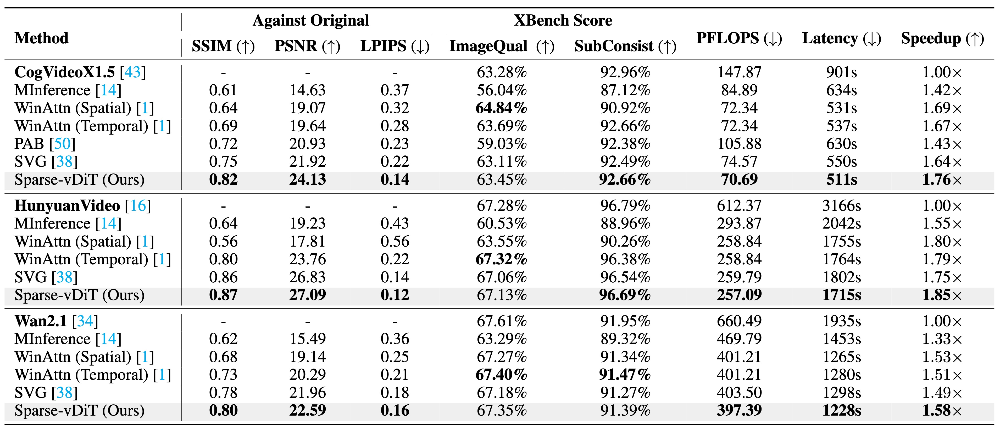

<!-- <div align= "center">
    <h1> Official repo for Sparse-vDiT</h1>

</div> -->

<h2 align="center"><strong>Sparse-vDiT: Unleashing the Power of Sparse Attention to Accelerate Video Diffusion Transformers</strong></h2>

<div align="center">
<a href='https://arxiv.org/abs/2506.****'></a> &nbsp;&nbsp;&nbsp;&nbsp;
</div>

<p align="center">
    
</p>

## 🥳 What's New 
- [2025/06/04] 👋 Upload paper and init project. [Read](https://arxiv.org/abs/****)

## 🎥 Demo
<div style="display: flex; justify-content: space-evenly; align-items: center; gap: 10px; margin: 20px 0;">
  <div style="text-align: center; flex: 1;">
    
    <p style="margin-top: 8px; font-size: 14px; color: #555;">方法1</p>
  </div>
  <div style="text-align: center; flex: 1;">
    
    <p style="margin-top: 8px; font-size: 14px; color: #555;">方法2</p>
  </div>
  <div style="text-align: center; flex: 1;">
    
    <p style="margin-top: 8px; font-size: 14px; color: #555;">方法3</p>
  </div>
</div>

<p align="center">
    
</p>

## :pencil: To Do List
- [ ] Code and Config Release 
- [x] Technical Report


<!-- :hammer: Installation -->


<!-- 🎯 Quick Start -->


## :notebook: Citation

```bibtex
@article{chen2025sparsevdit,
  title={Sparse-vDiT: Unleashing the Power of Sparse Attention to Accelerate Video Diffusion Transformers}, 
  author={Pengtao Chen and Xianfang Zeng and Maosen Zhao and Peng Ye and Mingzhu Shen and Wei Cheng and Gang Yu and Tao Chen},
  journal={arXiv preprint arxiv:},
  year={2025}
}
```

## :dizzy: Acknowledgments
We thank the following excellent open-source works: [Sparse-VideoGen](https://github.com/svg-project/Sparse-VideoGen), [MInference](https://github.com/microsoft/MInference), [PAB](https://github.com/NUS-HPC-AI-Lab/VideoSys), [CogVideoX](https://github.com/THUDM/CogVideo), [HunyuanVideo](https://github.com/Tencent-Hunyuan/HunyuanVideo), [Wan2.1](https://github.com/Wan-Video/Wan2.1).

## :email: Contact
If you have any questions, please email [`Pengt.Chen@gmail.com`](mailto:Pengt.Chen@gmail.com).
